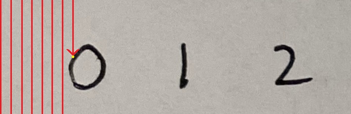
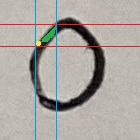
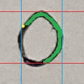
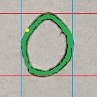

# Okra Digit-OCR Library

This is a library to read handwritten digits from images

## Getting Started

To get started, import okra, initialize a DigitGetter class, and start OCR'ing

```
import okra

dg = okra.DigitGetter()

numbers, confidence = dg.digits_from_image(*** Your image loaded with opencv ***)
```

The return values is a tuple that contains two lists. The first list contains
the digit values, and the second list contains confidence percentages for those
values.

## How It Works

### Pre-processing

First, the image is processed to prepare it for scanning and classification.
This includes applying a threshold to convert the image to black and white
where the handwriting is white and the background is black.


### Scanning and Digit Segmentation

The image is then scanned by column for pixels corresponding to handwriting.

<div align="center">
    
</div>

After a pixel has been found, the boundaries of the digit are found by running
a fill algorithm that visits every pixel of the handwritten digit. A segment of
the image can be taken using the boundary values.

<div align="center">
    
    
    
</div>

### Classification

Digit segments are classified using a convolutional neural network.
Pytorch was used to implement the classifier for this OCR. Input images are
resized to 28 by 28 pixels to match the MNIST dataset. The output of the
classifier is an array containing the probabilities that the digit is a
zero, one, two, etc...
