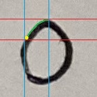
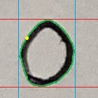

# OCR Package

This is a package to read handwritten digits from scoresheet images

## Modules

There are two modules:

1. **okra** - Contains the DigitGetter class that handles OCR.
1. **violin** - Contains validation/processing functions for raw OCR output.

## Configuration

To import this package, Python must be able to find it. Add the repo's root folder
to the PYTHONPATH environment variable.

> [!IMPORTANT]
> Make sure to use YOUR path to the repo folder and not the dummy path in the example commands!

### Linux

`export PYTHONPATH="${PYTHONPATH}:/path/to/seniordesign"`

### Windows

See if your editor has a PYTHONPATH manager or something similar.
Otherwise, in Command Prompt try running *`set PYTHONPATH=%PYTHONPATH%;C:\path\to\seniordesign`

### MacOS

*`export PYTHONPATH="/path/to/seniordesign:$PYTHONPATH"`

<br>

__*Let Paul know if these commmands actually work ¯\\\_(ツ)\_/¯__

## Getting Started

To get started, import the DigitGetter class, instantiate DigitGetter, and start OCR'ing

```
from OCR.okra import DigitGetter

dg = DigitGetter()

numbers, confidence = dg.image_to_digits(*** Your image data ***)
```

The return values is a tuple that contains two lists. The first list contains
the digit values, and the second list contains confidence percentages for those
values. Also, the *violin* package contains functions for automatically handling
raw OCR output:

```
from OCR.violin import validate_score

raw_output = dg.image_to_digits(*** Image of score field ***)

output_string, overall_confidence = validate_score(raw_output, max=10, min=1)
```

## How It Works

### Pre-processing

First, the image is processed to prepare it for scanning and classification.
This includes applying a threshold to convert the image to black and white
where the handwriting is white and the background is black.


### Scanning and Digit Segmentation

The image is then scanned by column for pixels corresponding to handwriting.

<div align="center">
    
</div>

After a pixel has been found, the boundaries of the digit are found by running
a trace algorithm that follows the edges of the digit until it has traced its entire outside border.
A segment of the image can be taken using the boundary values.

<div align="center">
    
    
    
</div>

### Classification

Digit segments are classified using a convolutional neural network.
Pytorch was used to implement the classifier for this OCR. Input images are
resized to 28 by 28 pixels to match the MNIST dataset. The output of the
classifier is an array containing the probabilities that the digit is a
zero, one, two, etc...
