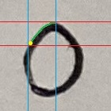
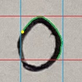

# OCR Package

This is a package to read handwritten digits from scoresheet images.

## Modules

### okra

The **okra** module contains the DigitGetter class which is responsible for OCR.

- (_class_) `DigitGetter`
    - Methods
        - (_fn_) `image_to_digits`  -> Extracts a row of digits from an image.
    - Fields
        - (_bool_) `debug_images`   -> Use matplotlib to show helpful debugging images (default=`False`).
        - (_bool_) `use_width_as_reference` -> Use the image width instead of height as a reference
                                               when identifying handwriting segments. This is useful
                                               when the heights of the input images vary a lot (default=`False`).
        - (_int_) `column_skip`     -> The number of image columns to be skipped each loop of the scan (default=`2`).
        - (_int_) `blank_threshold` -> The max difference between the lightest and darkest pixels in an image
                                       for it to be considered a blank segment (default=`120`).
        - (_float_) `scribble_threshold`    -> The percentage of pixels in a segment that have to be filled-in
                                               to be considered a scribbled out number (default=`80.0`).

See *okra.py* for more detailed information.

### violin

The **violin** module contains validation/autocorrect functions that handle raw OCR output from the DigitGetter class.

- (_fn_) `validate_score`        -> Enforces a score range.
- (_fn_) `validate_rider_number` -> Returns a value of the form *L##*.
- (_fn_) `validate_time`         -> Ensures that a reasonable time value is returned.
- (_fn_) `validate_weight`       -> Ensures that a reasonable weight value is returned.

See *violin.py* for more detailed information.

## Getting Started

### Importing

```python
# Import the entire package
import OCR

# ...
OCR.okra
OCR.violin

# Or import each module individually
from OCR import okra
from OCR import violin

# ...
okra
violin
```

### Running the OCR

```python
# Create an instance of the DigitGetter class
dg = okra.DigitGetter()

# Call the image_to_digits method with an image
output = dg.image_to_digits(*** Your image array ***)

type(output) # <class 'tuple'>

# Auto-unpack the output:
# The first item is a list of the extracted values.
# The second item is a list of percentages representing the confidence.
numbers, confidence = output

type(numbers) # <class 'list'>
type(confidence) # <class 'list'>

type(numbers[0]) # <class 'int'> or <class 'str'>
type(confidence[0]) # <class 'float'>
```

### Validation

```python
# All validation functions recieve OCR output and return:
# 1. A string representing the extracted values.
# 2. A float representing the percent confidence of the extraction.

# The score validation has optional max and min values
output_string, output_confidence = violin.validate_score(ocr_output, max=10, min=1)

# The other validation functions only recieve the OCR output
output_string, output_confidence = violin.validate_rider_number(ocr_output)
output_string, output_confidence = violin.validate_time(ocr_output)
output_string, output_confidence = violin.validate_weight(ocr_output)

type(output_string) # <class 'str'>
type(output_confidence) # <class 'float'>
```

## How It Works

### Pre-processing

First, the image is processed to prepare it for scanning and classification.
This includes applying a threshold to convert the image to black and white
where the handwriting is white and the background is black.

### Scanning and Digit Segmentation

The image is then scanned by column for pixels corresponding to handwriting.

<div align="center">
    
</div>

After a pixel has been found, the boundaries of the digit are found by running
a trace algorithm that follows the edges of the digit until it has traced its entire outside border.
A segment of the image can be taken using the boundary values.

<div align="center">
    
    
    
</div>

In addition to digits, other symbols may be encountered in image. These include minus symbols,
decimal points, field separator lines, scribbled-out errors, and random "noise" pixels. With the
exception of the decimal points, these segments are ignored.

### Classification

Digit segments are classified using a convolutional neural network.
Specifically, the ResNet-18 model was used with a slight modification to
accommodate the format of the input images. Pytorch was used to train and
run the classifier for this OCR. For training, the MNIST dataset was intially
chosen, but the much larger [EMNIST](https://huggingface.co/datasets/ernestchu/emnist-digits)
dataset was used for the final training.

In production, the classifier model will be served using
[TorchServe](../../../model_server/README.md).

## Known Issues

### Digit Overlap

Due to the nature of the OCR algorithm, if two or more digits are written such that they touch
each other, the OCR will erroneously treat these numbers as one single digit. A reliable method
to detect this issue and split the digits apart has not been found yet. For now, it is encouraged
that those filling in the scoresheets be careful to put space in between the digits of multi-digit
numbers.

### Light Handwriting

When the scoresheet is filled in with a pencil, *very light* handwriting may result in poor OCR performance.
This issue can be circumvented by simply pressing harder when writing the numbers down.
