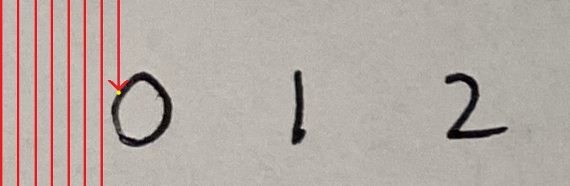
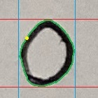

# OCR Package

This is a package to read handwritten digits from scoresheet images

## Modules

### okra

The **okra** module contains the DigitGetter class which is responsible for OCR.

- (class) `DigitGetter`
    - (fn) `digit_from_image` -> Extracts a single digit from a square image. (Don't use this one)
    - (fn) `image_to_digits`  -> Extracts a row of digits from an image. (Use this one)

See *okra.py* for more detailed information.

### violin

The **violin** module contains validation/autocorrect functions that handle raw OCR output from the DigitGetter class.

- (fn) `validate_score`        -> Enforces a score range.
- (fn) `validate_rider_number` -> Returns a value of the form *L##*.
- (fn) `validate_time`         -> Ensures that a reasonable time value is returned.
- (fn) `validate_weight`       -> Ensures that a reasonable weight value is returned.

See *violin.py* for more detailed information.

## Getting Started

### Importing

```python
# Import the entire package
import OCR

# ...
OCR.okra
OCR.violin

# Or import each module individually
from OCR import okra
from OCR import violin

# ...
okra
violin
```

### Running the OCR

```python
# Create an instance of the DigitGetter class
dg = okra.DigitGetter()

# Call the image_to_digits method with an image
output = dg.image_to_digits(*** Your image array ***)

type(output) # <class 'tuple'>

# Auto-unpack the output:
# The first item is a list of the extracted values.
# The second item is a list of percentages representing the confidence.
numbers, confidence = output

type(numbers) # <class 'list'>
type(confidence) # <class 'list'>

type(numbers[0]) # <class 'int'> or <class 'str'>
type(confidence[0]) # <class 'float'>
```

### Validation

```python
# All validation functions recieve OCR output and return:
# 1. A string representing the extracted values.
# 2. A percentage representing the confidence of the extraction.

# The score validation has optional max and min values
output_string, output_confidence = violin.validate_score(ocr_output, max=10, min=1)

# The other validation functions only recieve the OCR output
output_string, output_confidence = violin.validate_rider_number(ocr_output)
output_string, output_confidence = violin.validate_time(ocr_output)
output_string, output_confidence = violin.validate_weight(ocr_output)

type(output_string) # <class 'str'>
type(output_confidence) # <class 'float'>
```

## How It Works

### Pre-processing

First, the image is processed to prepare it for scanning and classification.
This includes applying a threshold to convert the image to black and white
where the handwriting is white and the background is black.


### Scanning and Digit Segmentation

The image is then scanned by column for pixels corresponding to handwriting.

<div align="center">
    
</div>

After a pixel has been found, the boundaries of the digit are found by running
a trace algorithm that follows the edges of the digit until it has traced its entire outside border.
A segment of the image can be taken using the boundary values.

<div align="center">
    
    
    
</div>

### Classification

Digit segments are classified using a convolutional neural network.
Pytorch was used to implement the classifier for this OCR. Input images are
resized to 28 by 28 pixels to match the MNIST dataset. The output of the
classifier is an array containing the probabilities that the digit is a
zero, one, two, etc...
